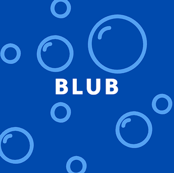

[](https://opensource.org/licenses/MIT)

<!-- Template link  See: https://github.com/othneildrew/Best-README-Template/pull/73 -->
<a name="readme-top"></a>


<!-- PROJECT LOGO -->
<br />
<div align="center">
  <a href="https://github.com/github_username/repo_name">
    
  </a>

<h3 align="center">Blub</h3>

  <p align="center">
    Ocean themed chat room
    <br />
    <a href="https://github.com/UTOR-Group-6/messaging-app"><strong>Explore the docs »</strong></a>
    <br />
    <br />
    <a href="https://github.com/github_username/repo_name">View Demo</a>
    ·
    <a href="https://github.com/UTOR-Group-6/messaging-app/issues">Report Bug</a>
    ·
    <a href="https://github.com/UTOR-Group-6/messaging-app/issues">Request Feature</a>
  </p>
</div>


<!-- TABLE OF CONTENTS -->
<details>
  <summary>Table of Contents</summary>
  <ol>
    <li>
      <a href="#about-the-project">About The Project</a>
      <ul>
        <li><a href="#built-with">Built With</a></li>
      </ul>
    </li>
    <li>
      <a href="#getting-started">Getting Started</a>
      <ul>
        <li><a href="#prerequisites">Prerequisites</a></li>
        <li><a href="#installation">Installation</a></li>
      </ul>
    </li>
    <li><a href="#usage">Usage</a></li>
    <li><a href="#roadmap">Roadmap</a></li>
    <li><a href="#contributing">Contributing</a></li>
    <li><a href="#license">License</a></li>
    <li><a href="#contact">Contact</a></li>
    <li><a href="#acknowledgments">Acknowledgments</a></li>
  </ol>
</details>


<!-- ABOUT THE PROJECT -->
## About The Project
Blub is a messaging app which offers flexible communication from a single platform. Communicate online with others in real time, enjoy connecting with your friends and making new ones. 
This messaging application differs from others as the theme was specifically selected for the users experiance, the ocean theme and various hues of blue were implemented to promote a positive and calming response.
<br>
[![Product Name Screen Shot][product-screenshot]](https://example.com)


<p align="right">(<a href="#readme-top">back to top</a>)</p>


### Built With

* 
* ![css]
* [![React][React.js]][React-url]
* [![Node][Node.js]][Node-url]
* [![Express]][Express-url]
* [![mongodb]][mongodb-url]
* 
* 
* 


<p align="right">(<a href="#readme-top">back to top</a>)</p>


<!-- GETTING STARTED -->
## Getting Started


[Deployed Website]()

### Prerequisites


* install dependencies:
  ```sh
  npm install
  ```

### Installation


1. Clone the repo
   ```sh
   git clone https://github.com/UTOR-Group-6/messaging-app.git
   ```
3. Install NPM packages
   ```sh
   npm install
   ```
4. Execute script
   ```sh
   npm run develop
   ```
<p align="right">(<a href="#readme-top">back to top</a>)</p>


<!-- USAGE EXAMPLES -->
## Usage

<p align="right">(<a href="#readme-top">back to top</a>)</p>


<!-- ROADMAP -->
## Roadmap

- [x] Use React for the front end
- [x] Use GraphQL with a Node.js and Express.js server.
- [x] Use MongoDB and the Mongoose ODM for the database
- [x] Use queries and mutations for retrieving, adding, updating, and deleting data
- [x] Deployed using Heroku with data
- [x] Polished UI
- [x] Responsive
- [x] Interactive (accept and respond to user input)
- [x] JWT authentication included
- [x] Protect sensitive API key information on the server
- [x] Clean repository that meets quality coding standards
- [x] High-quality README


See the [open issues](https://github.com/github_username/repo_name/issues) for a full list of proposed features (and known issues).

<p align="right">(<a href="#readme-top">back to top</a>)</p>


<!-- CONTRIBUTING -->
## Contributing
### Tasks and Roles 
Phoenix Ouyang
> Created and set up Login/Sign up forms, created authentications and instant page reload. <br>
> Created functional chat feature.<br>
> Styling
---
Julia Bernst
> Created user profile page and picture upload feature.
> Styling
---
Karim Nasreddine
> implemented chat request<br>
> set up models for users, Messages and Chats<br>
> Styling<br>
> Deployed application
---
Rajvir Dhanoa
> User Settings<br>
> created readme document<br>
> styling 
---


<p align="right">(<a href="#readme-top">back to top</a>)</p>


<!-- LICENSE -->
## License

Distributed under the MIT License. See `LICENSE.txt` for more information.

<p align="right">(<a href="#readme-top">back to top</a>)</p>


<!-- CONTACT -->
## Contact

Repository: [https://github.com/UTOR-Group-6/messaging-app](hhttps://github.com/UTOR-Group-6/messaging-app)

---
Phoenix Ouyang
> [https://github.com/phoenixouyang](https://github.com/phoenixouyang)

---
Julia Bernst
> [https://github.com/jubernst](https://github.com/jubernst)

---
Karim Nasreddine
> [https://github.com/KareemND](https://github.com/KareemND)

---
Rajvir Dhanoa
> [https://github.com/phoenixouyang](https://github.com/phoenixouyang)

<p align="right">(<a href="#readme-top">back to top</a>)</p>

<!-- ACKNOWLEDGMENTS -->
## Acknowledgments

* [Ocean Audio](https://pixabay.com/users/juliush-3921568/)
* [Background Images](https://www.freepik.com/author/upklyak)

<p align="right">(<a href="#readme-top">back to top</a>)</p>


<!-- MARKDOWN LINKS & IMAGES -->

[React.js]: https://img.shields.io/badge/React-20232A?style=for-the-badge&logo=react&logoColor=61DAFB
[React-url]: https://reactjs.org/

[Node.js]: https://img.shields.io/badge/Node.js-43853D?style=for-the-badge&logo=node.js&logoColor=white
[Node-url]:https://www.npmjs.com/package/node

[Express]:https://img.shields.io/badge/Express.js-404D59?style=for-the-badge
[Express-url]:https://www.npmjs.com/package/express

[mongodb]:https://img.shields.io/badge/MongoDB-4EA94B?style=for-the-badge&logo=mongodb&logoColor=white
[mongodb-url]:https://www.mongodb.com/

[css]:https://img.shields.io/badge/CSS-239120?&style=for-the-badge&logo=css3&logoColor=white

[jest]:https://img.shields.io/badge/Jest-323330?style=for-the-badge&logo=Jest&logoColor=white
[jest-url]:https://www.npmjs.com/package/jest


